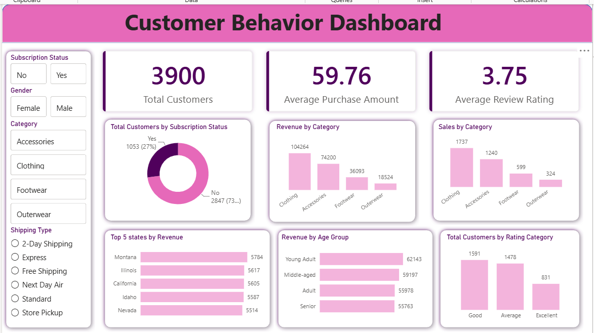

# Customer Shoping Behavior Analysis 

## 📌 Project Overview

This project analyzes customer shopping behavior using Python, PostgreSQL, and Power BI to uncover purchasing patterns, customer preferences, spending habits, and revenue trends.

The project follows an end-to-end data analytics workflow involving data cleaning, SQL-based business analysis, and interactive dashboard development.

---

## 🎯 Business Objective

Retail businesses generate large amounts of customer transaction data. Understanding customer demographics, purchasing behavior, and spending patterns can help organizations:

- Improve customer retention
- Optimize product offerings
- Enhance marketing strategies
- Increase revenue through targeted promotions
- Understand customer purchasing trends

---

## 📂 Dataset Information

The dataset contains customer shopping records with features such as:

- Customer ID
- Age
- Gender
- Category
- Item Purchased
- Purchase Amount
- Review Rating
- Subscription Status
- Shipping Type
- Discount Applied
- Previous Purchases
- Frequency of Purchases

---

## 🔄 Project Workflow

### 1️⃣ Data Cleaning & Preprocessing (Python)

Performed the following tasks:

- Loaded and explored customer shopping data
- Standardized column names
- Handled missing values
- Created customer age groups
- Converted categorical variables into meaningful formats
- Removed unnecessary columns
- Prepared the dataset for SQL and Power BI analysis

---

### 2️⃣ SQL Analysis (PostgreSQL)

Business analysis was performed using SQL queries.

#### Revenue Analysis
- Revenue by gender
- Revenue by age group

#### Customer Analysis
- Subscriber vs non-subscriber comparison
- Discount usage analysis
- Repeat customer analysis

#### Product Analysis
- Top-rated products
- Most purchased products
- Discount effectiveness by product

#### Shipping Analysis
- Purchase behavior across shipping methods

#### Customer Segmentation
- New Customers
- Returning Customers
- Loyal Customers

---

### 3️⃣ Dashboard Development (Power BI)

An interactive dashboard was created to visualize customer behavior and business performance.

#### KPI Cards
- Total Customers
- Average Purchase Amount
- Average Review Rating

#### Visualizations
- Revenue by Age Group
- Revenue by Gender
- Customer Distribution
- Product Performance Analysis
- Review Rating Analysis
- Purchase Trends

#### Dashboard Features
- Interactive Filters
- Dynamic Insights
- Cross-filtering Visuals
- KPI Monitoring

---

## 📷 Dashboard Preview



---

## 📊 Key Insights

- Clothing was the most popular category, generating the highest revenue and purchase volume among all product categories.

- Young Adult customers contributed the highest revenue, indicating that this age group is the most active shopper segment.

- A large majority of customers were non-subscribers, suggesting an opportunity to improve customer retention through subscription programs.

- Customer reviews were generally positive, with most ratings falling in the Good and Average categories.

- Purchase behavior varied across customer segments, shipping methods, and discount usage, highlighting factors that influence buying decisions.

---

## 🛠️ Tools & Technologies Used

| Tool | Purpose |
|--------|---------|
| Python | Data Cleaning & Analysis |
| Pandas | Data Manipulation |
| PostgreSQL | Data Storage & Querying |
| SQL | Business Analysis |
| SQLAlchemy | Database Connection |
| Power BI | Dashboard Development |
| DAX | KPI Calculations |

---

## 📁 Project Structure

```text
Customer-Purchase-Behavior-Analysis/
│
├── dashboard.png
├── customer_shoping_behavior.ipynb
├── customer_behavior_analysis_queries.sql
├── Customer Behavior Dashboard.pbit
├── README.md
└── customer_shopping_behavior.csv
```

---

## 🚀 Skills Demonstrated

- Data Cleaning
- Exploratory Data Analysis (EDA)
- Feature Engineering
- SQL Query Writing
- Customer Segmentation
- Business Intelligence
- Dashboard Development
- Data Visualization
- KPI Design
- Analytical Thinking

---

